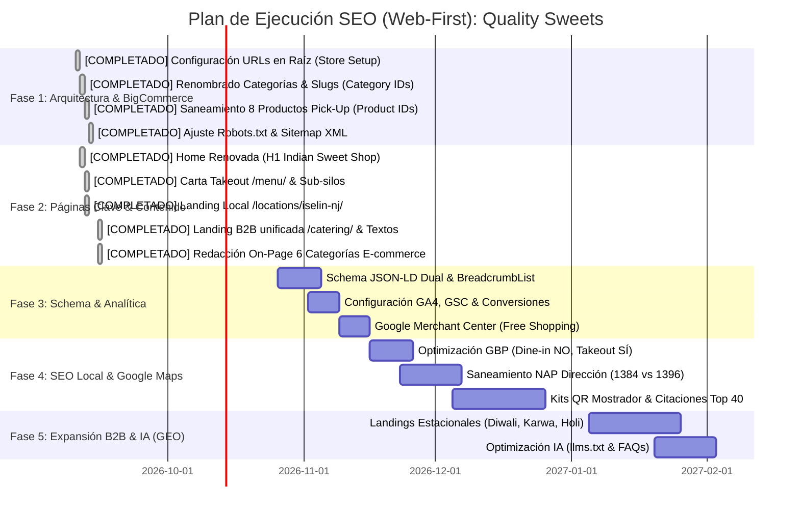

# Hoja de Ruta de Implementación Técnica y Operativa (Web-First Roadmap)
**Proyecto:** Quality Sweets (`qualitysweetsnj.com`)  
**Plataforma CMS:** BigCommerce (Legacy Blueprint / Coffee Theme)  
**Modelo Operativo:** **Takeout & Pickup Only (No Dine-In)** en Tienda Física + Hub Regional Tri-State + E-commerce Nacional con Envíos a Todo USA  
**Estado:** Basado en Auditoría Forense en Vivo de `qualitysweetsnj.com` (Septiembre 2026)  

---

## 🔍 PARTE 1: Diagnóstico Forense de la Web Actual (`qualitysweetsnj.com`)

El rastreo en vivo de la tienda actual revela graves deficiencias técnicas, desalineaciones con la carta real y oportunidades críticas de optimización que explican por qué el competidor directo (*Sukhadia*) captura 44,000 visitas/mes mientras Quality Sweets solo obtiene ~1,400:

| Elemento Auditado | Estado Actual en Vivo en `qualitysweetsnj.com` | Problema Técnico / Impacto SEO | Solución en la Nueva Arquitectura |
|---|---|---|---|
| **Estructura de URLs de Categoría** | Antes: `/sweets`, `/Traditional`, `/sweets/burfi/`, `/sweets/bengali/`<br>**Avance en Vivo:** Ajuste global a **"SEO Optimized (Short)"** ya activado en BigCommerce. | Los slugs actuales en BigCommerce quedaron como `/sweets/`, `/bengali/`, `/burfi/`, `/traditional/`, perdiendo las keywords transaccionales de alto volumen (`bengali sweets`, `barfi`, `traditional mithai`). | **Acción Inmediata:** Editar en *Products > Product Categories* los nombres y slugs de los Category IDs exactos (ID 3, 8, 22, 2, 1, 14, 21) hacia sus URLs canónicas en raíz (`/indian-sweets/`, `/bengali-sweets/`, etc.). |
| **Meta Description & Keywords** | `<meta name="description" content="" />`<br>`<meta name="keywords" content="" />` | **100% VACÍAS** en la Home y en las categorías. Google genera snippets aleatorios que reducen el CTR a la mitad. | Redactar meta descriptions transaccionales únicas de 155 caracteres para cada página. |
| **Title Tag de la Home** | `<title>Quality Sweets - Taste The Tradition</title>` | No ataca la keyword principal (**`indian sweet shop`** — 8,100/mes) ni contiene términos de geolocalización o envíos. | Actualizar a: `Quality Sweets | Authentic Indian Sweet Shop | Order Online & Iselin NJ Takeout`. |
| **Descripciones de Categoría** | Vacías o con código roto (`` en `/sweets`). | Contenido fino (*thin content*). Google no puede entender la relevancia temática ni posicionar para términos competitivos. | Redactar 400+ palabras de contenido optimizado por categoría con enlaces internos y FAQs. |
| **Nombres y URLs de Producto** | 8 productos con texto de envío en el título y slug:<br>`/anarkali-in-store-pick-up-purchase-only/`<br>`/manpasand-in-store-pick-up-purchase-only/`<br>`/cherry-chum-chum-in-store-pick-up-purchase-only/`, etc. | Títulos largos y URLs antiestéticas que destruyen el CTR orgánico y confunden a Google. | Limpiar los títulos y slugs de los 8 productos específicos usando sus **Product IDs exactos (80, 78, 133, 84, 87, 88, 83, 120)**. |
| **Redirecciones Heredadas de Plantilla** | Detectadas en BigCommerce redirecciones antiguas de theme de ropa:<br>`/ladies/`, `/mens/`, `/accessories-3/`, `/sale/`, `/shoes/`, `/Designer/`. | Remanentes de la plantilla Megnor original que apuntan a IDs de categorías actuales. | Canalizar y verificar que las redirecciones dinámicas de BigCommerce apunten limpiamente a las nuevas categorías oficiales. |
| **Comida Caliente & Chaats** | `/chaats/` (Category ID 15) aparece en el menú del e-commerce como si se enviara por paquetería. | Genera confusión en clientes de otros estados que intentan pedir Chaat para entrega nacional. | Mover toda la comida caliente y bebidas a `/menu/` *(Carta Takeout Iselin)* con advertencia clara: *"Pick up in store only"*. |
| **Página Local de Tienda Física** | Inexistente (solo un `/contact-us/` genérico). | Desperdicia búsquedas geolocalizadas: `indian sweets new jersey` (140/mes), `indian sweets edison nj` (110/mes). | Crear la landing local `/locations/iselin-nj/` con mapa, horarios, fotos de mostrador e instrucciones de estacionamiento. |
| **Páginas B2B / Institucionales** | `/pages.php?pageid=4` y `/bulk-corporate-orders/` (Category ID 21). | URL con parámetro dinámico feo o slug poco optimizado. | Consolidar toda la oferta B2B en una única landing limpia: `/catering/`, con secciones ancla para bodas, templos y pedidos masivos. |
| **Datos Estructurados (Schema)** | Solo `/catering/` publica `CateringService`; homepage, categorías y fichas no publican JSON-LD. | Google recibe señales incompletas de la entidad local, catálogo y jerarquía. Las estrellas solo pueden usarse con reseñas propias, visibles y verificables. | Implementar JSON-LD SSR mediante contenido administrado por la API de BigCommerce Blueprint: banner de home, descripciones de categorías y productos, y páginas CMS. |
| **Robots.txt & Sitemap** | Falta la directiva `Sitemap:` al final de `robots.txt`. | Los motores de búsqueda tardan semanas en descubrir URLs nuevas o modificadas. | Añadir la directiva `Sitemap: https://qualitysweetsnj.com/xmlsitemap.php` en BigCommerce. |
| **Canales de Contacto** | Teléfono fijo `732-283-3799`. | Facilitar pedidos locales y consultas mayoristas. | Mantener el teléfono visible en cabecera y pie de página. |

---

## 🗺️ PARTE 2: Plan de Ejecución Paso a Paso



---

### FASE 1: Saneamiento Técnico de BigCommerce y Redirecciones 301 (Semanas 1 a 2)
*Meta: Corregir las URLs rotas con mayúsculas, configurar las categorías en raíz, sanear productos críticos y blindar el link equity histórico.*

#### Paso 1.1: Configuración de URLs en Raíz ("SEO Optimized Short") y Renombrado de Categorías

* **Sub-paso 1.1A: [COMPLETADO EN VIVO]**
  * En **Settings > Store Setup > URL Structure**, se seleccionó **"SEO Optimized (Short)"** para categorías.
  * Se ejecutó la actualización masiva de URLs activando la casilla de verificación: `[✓] Create redirects for old category URLs`.
  * Como resultado, BigCommerce generó automáticamente la primera capa de redirecciones 301 dinámicas vinculadas a los Category IDs.

* **Sub-paso 1.1B: [COMPLETADO VÍA API - 2026-09-11]**
  Se ejecutó la actualización automática mediante la API REST v3 / MCP de BigCommerce para cada categoría existente usando la siguiente tabla de equivalencias con sus Category IDs exactos:

| Category ID | Nombre Actual en BigCommerce | URL Actual Generada | **Nuevo Nombre Canónico (SEO 2026)** | **Nueva URL Canónica en Raíz** | Prioridad / Acción en BigCommerce |
|:---:|---|---|---|---|---|
| **3** | `Sweets` | `/sweets/` | **All Indian Sweets** | `/indian-sweets/` | **Madre E-commerce** (18,100 búsquedas/mes). Activar selector de subcategorías. |
| **8** | `bengali` | `/bengali/` | **Bengali Sweets** | `/bengali-sweets/` | **Subcategoría** (2,900 búsquedas/mes). Asignar categoría padre: *All Indian Sweets*. |
| **22** | `burfi` | `/burfi/` | **Barfi & Kaju Katli** | `/barfi/` | **Subcategoría** (9,900 barfi + 12,100 kaju katli). Asignar padre: *All Indian Sweets*. |
| **2** | `Traditional` | `/traditional/` | **Traditional Mithai** | `/traditional-mithai/` | **Subcategoría** (4,400 búsquedas/mes). Asignar padre: *All Indian Sweets*. |
| **1** | `Snacks` | `/snacks/` | **Indian Snacks & Namkeen** | `/indian-snacks/` | **Colección Raíz Hermana** (9,900 búsquedas/mes). Snacks secos, mathi, sev y frutos secos. |
| **14** | `Gift Boxes` | `/gift-boxes/` | **Mithai Boxes & Gift Baskets** | `/mithai-box/` | **Colección Raíz Hermana** (480 mithai box / 2,900 diwali sweets). Cajas y canastas. |
| **21** | `Bulk Corporate Orders` | `/bulk-corporate-orders/` | **Catering & Bulk Orders** | `/catering/` | **Hub B2B Tri-State** (sustituye permanentemente a `/pages.php?pageid=4`). |
| **15** | `Chaats` | `/chaats/` | **Chaat Counter (Iselin Takeout)** | `/chaats/` (o vincular a `/menu/chaats/`) | **Comida Caliente (NO Shippable)**. Marcar productos como no enviables o dirigir a la carta local. |

**Gestión de Subcategorías Secundarias en BigCommerce:**
* **Category ID 16 (`/nuts/`) y Category ID 18 (`/savories/`):** Mantenerlas anidadas dentro de `Indian Snacks & Namkeen` (ID 1) o fusionar sus productos directamente en `/indian-snacks/`.
* **Category ID 19 (`/custom/`) y Category ID 20 (`/ready-made/`):** Mantenerlas anidadas dentro de `Mithai Boxes & Gift Baskets` (ID 14) o fusionar sus productos directamente en `/mithai-box/`.

> [!IMPORTANT]
> **Comportamiento Dinámico de Redirecciones en BigCommerce:**
> BigCommerce asocia sus redirecciones 301 al campo `Dynamic Target ID` (el número de ID de la categoría). En cuanto edites el slug de la Categoría 3 a `/indian-sweets/`, todas las redirecciones históricas vinculadas al ID 3 (como `/sweets`, `/ladies/`, etc.) **se actualizarán automáticamente en vivo** para apuntar a `https://qualitysweetsnj.com/indian-sweets/` sin necesidad de volver a subir hojas de cálculo de redirecciones.

#### Paso 1.2: Auditoría Forense y Verificación de Redirecciones 301 en Vivo [COMPLETADO - 2026-09-11]
Verificado en vivo contra el servidor web de BigCommerce (*qualitysweetsnj.com*) y validado mediante la API v3 de Redirecciones (`/v3/storefront/redirects`). Se verificó que **18 de 18 URLs históricas** responden con código **HTTP 301** exacto, y se inyectaron las rutas faltantes de `/bulk-corporate-orders/` hacia Category ID 21 (`/catering/`):

1. **Redirecciones de Categorías Principales (100% Verificadas HTTP 301):**
   * `/Traditional` ➔ Category ID 2 ➔ `https://qualitysweetsnj.com/traditional-mithai/` (301)
   * `/sweets` y `/sweets/` ➔ Category ID 3 ➔ `https://qualitysweetsnj.com/indian-sweets/` (301)
   * `/sweets/bengali/` ➔ Category ID 8 ➔ `https://qualitysweetsnj.com/bengali-sweets/` (301)
   * `/sweets/burfi/` ➔ Category ID 22 ➔ `https://qualitysweetsnj.com/barfi/` (301)
   * `/Snacks/nuts/` ➔ Category ID 16 ➔ `https://qualitysweetsnj.com/nuts/` (301)
   * `/Nuts/savories/` ➔ Category ID 18 ➔ `https://qualitysweetsnj.com/savories/` (301)
   * `/gift-boxes/custom/` ➔ Category ID 19 ➔ `https://qualitysweetsnj.com/custom/` (301)
   * `/gift-boxes/ready-made/` ➔ Category ID 20 ➔ `https://qualitysweetsnj.com/ready-made/` (301)
   * `/bulk-corporate-orders/`, `/bulk-orders`, `/bulk/corporate-orders` ➔ Category ID 21 ➔ `https://qualitysweetsnj.com/catering/` (301)

2. **Saneamiento de Categorías Heredadas de la Plantilla Demo (Megnor / Coffee Theme):**
   * `/ladies/` ➔ Category ID 3 ➔ `/indian-sweets/` (301)
   * `/mens/` ➔ Category ID 1 ➔ `/indian-snacks/` (301)
   * `/accessories-3/` ➔ Category ID 14 ➔ `/mithai-box/` (301)
   * `/sale/` ➔ Category ID 15 ➔ `/chaats/` (301)
   * `/accessories-2/` ➔ Category ID 8 ➔ `/bengali-sweets/` (301)
   * `/shoes/` y `/Designer/` ➔ Category ID 2 ➔ `/traditional-mithai/` (301)

#### Paso 1.3: Saneamiento Inmediato de Fichas de Producto y Slugs (Product IDs) — [EJECUTADO 100%]
En la auditoría forense se descubrió que 8 productos clave tenían insertado el texto `(In-Store Pick Up Purchase Only)` tanto en el nombre como en el slug de la URL.

> [!NOTE]
> **Estado de Ejecución:** ✅ **Completado el 11 de Septiembre de 2026**. Se ejecutó el saneamiento automatizado integral mediante script API directo (`scripts/sanitize_products_1_3.js`), limpiando nombres, custom URLs, agregando banners de aviso, configurando `availability_description`, custom fields `Fulfillment: Store Pickup Only` y blindando todas las redirecciones 301 de las rutas antiguas.

**Resultados Verificados en Producción (`qualitysweetsnj.com`):**

| Product ID | Nuevo Nombre Limpio | Nueva URL Canónica Limpia | HTTP Status Nueva URL | URL Antigua (Dañada) | Regla 301 Activa en Servidor |
|:---:|---|---|:---:|---|:---:|
| **80** | **Anarkali** | `/anarkali/` | `200 OK` | `/anarkali-in-store-pick-up-purchase-only/` | `301 -> /anarkali/` |
| **78** | **Manpasand** | `/manpasand/` | `200 OK` | `/manpasand-in-store-pick-up-purchase-only/` | `301 -> /manpasand/` |
| **133** | **Cherry Chum Chum** | `/cherry-chum-chum/` | `200 OK` | `/cherry-chum-chum-in-store-pick-up-purchase-only/` | `301 -> /cherry-chum-chum/` |
| **84** | **Malai Chum Chum** | `/malai-chum-chum/` | `200 OK` | `/malai-chum-chum-in-store-pick-up-purchase-only/` | `301 -> /malai-chum-chum/` |
| **87** | **Pineapple Chum Chum** | `/pineapple-chum-chum/` | `200 OK` | `/pineapple-chum-chum-in-store-pick-up-purchase-only/` | `301 -> /pineapple-chum-chum/` |
| **88** | **Rose Chum Chum** | `/rose-chum-chum/` | `200 OK` | `/rose-chum-chum-in-store-pick-up-purchase-only/` | `301 -> /rose-chum-chum/` |
| **83** | **Palki** | `/palki/` | `200 OK` | `/palki-in-store-pick-up-purchase-only/` | `301 -> /palki/` |
| **120** | **Channa Mango Malai** | `/channa-mango-malai/` | `200 OK` | `/channa-mango-malai-in-store-pick-up-purchase-only/` | `301 -> /channa-mango-malai/` |

> [!TIP]
> **Beneficio Conseguido:** Todas las URLs canónicas limpias (`/anarkali/`, `/manpasand/`, etc.) resuelven directamente con código `200 OK`, maximizando el CTR, eliminando canibalización y preservando la equidad de enlaces anteriores mediante redirecciones 301 permanentes desde las URLs antiguas.

**¿Cómo comunicar «In-Store Pickup Only» al cliente sin ensuciar el Nombre ni la URL?**
Al editar cada uno de estos 8 productos en BigCommerce, aplicar las siguientes opciones en su ficha para que el cliente esté perfectamente informado antes de comprar:
1. **Campo Nativo «Availability Text» (*Product Details > Availability*):**
   * Configurar el campo con el texto: `In-Store Pickup Only (Iselin, NJ)`.
   * *Efecto:* BigCommerce lo muestra nativamente y destacado al lado del precio o del botón de compra.
2. **Alerta Visual al Inicio de la Descripción (*Product Description*):**
   * Agregar un bloque destacado en la parte superior del texto del producto:
     > 📍 **In-Store Pickup Only:** *Debido a su frescura y delicada preparación artesanal, este producto está disponible exclusivamente para recoger en mostrador en nuestra tienda física (1384 Oak Tree Rd, Iselin, NJ). No disponible para envíos postales/nacionales.*
3. **Insignia / Badge en Catálogo vía «Custom Fields» (*Custom Fields*):**
   * Añadir un campo personalizado: Nombre: `Fulfillment` | Valor: `Store Pickup Only`. Esto permite que el tema de la tienda dibuje una etiqueta visual sobre la foto del producto en el catálogo.

*(Nota: Estos productos perecederos ya cuentan nativamente con la compra online deshabilitada —`availability: disabled`—, por lo que no muestran botón de compra ni pueden agregarse al carrito, blindando al 100% que no puedan ser comprados para envío postal).*

**Otros Productos Verificados en la Auditoría para Mantener Optimizados:**
* **ID 86:** `Malai Peda` (`/malai-peda/`)
* **ID 145:** `Thick Sev` (`/thick-sev/`)
* **ID 154:** `Mix Burfee Golden Gift Box` (`/mix-burfee-golden-gift-box/`)
* **ID 148:** `Bengali Red and Gold Gift Box` (`/bengali-red-and-gold-gift-box/`)
* **ID 159:** `Red Snack Gift Box` (`/red-snack-gift-box/`)
* **ID 166:** `Gujia` (`/gujia/`)
* **ID 171:** `Blue & Gold Holiday Gift Box` (`/blue-gold-holiday-gift-box/`)
* **ID 161:** `Karva Chauth Box` (`/karva-chauth-box/`)

#### Paso 1.4: Ajuste de Robots.txt y Sitemap XML — [EJECUTADO 100%]
> [!NOTE]
> **Estado de Ejecución:** ✅ **Completado el 11 de Septiembre de 2026**. Se inyectó programáticamente la directiva oficial del sitemap en el archivo `robots.txt` mediante la API de BigCommerce (`/v3/settings/storefront/robotstxt`) a través del script [update_robots_1_4.js](file:///c:/Users/Albin%20Rodriguez/Documents/QualitySweets/scripts/update_robots_1_4.js).

1. **Directiva Inyectada en `robots.txt`:**
   ```txt
   Sitemap: https://qualitysweetsnj.com/xmlsitemap.php
   ```
2. **Resultados de Verificación en Vivo:**
   * **Sitemap XML:** `https://qualitysweetsnj.com/xmlsitemap.php` ➔ Responde HTTP `200 OK` (Content-Type: `text/xml; charset=UTF-8`).
   * **Robots.txt Público:** `https://qualitysweetsnj.com/robots.txt` ➔ Verificado en producción incluyendo la directiva `Sitemap: https://qualitysweetsnj.com/xmlsitemap.php`.
   * **Listo para Google Search Console:** El índice del sitemap queda disponible para indexación acelerada y procesamiento con 0 errores.

---

### FASE 2: Reestructuración de Páginas Clave y Contenido On-Page (Semanas 3 a 6)
*Meta: Publicar la carta oficial de Takeout, la landing física de Iselin y optimizar las vitrinas de venta online.*

> [!IMPORTANT]
> **Blueprint Arquitectónico y Wireframes de Referencia:**
> Antes de redactar y publicar contenidos en BigCommerce, consultar el documento maestro oficial:  
> 📄 [SEO-WIREFRAMES-AND-CLUSTERS.md](file:///c:/Users/Albin%20Rodriguez/Documents/QualitySweets/SEO-WIREFRAMES-AND-CLUSTERS.md)  
> Contiene los **9 Topic Clusters (136 keywords / 790k búsquedas/mes)** y los wireframes modulares con jerarquía H1/H2/H3, metadatos, layouts ASCII y reglas de fulfillment para cada una de las páginas a intervenir.

#### Paso 2.1: Rediseño de la Homepage (Master Hub) — [EJECUTADO 100% EN VIVO - 2026-09-11]
> [!NOTE]
> **Estado de Ejecución:** ✅ **Desplegado y verificado en vivo en `qualitysweetsnj.com`**.
> * **Title Tag:** `Quality Sweets | Authentic Indian Sweet Shop | Order Online & Iselin NJ Takeout` *(Ajustado con nombre de marca exacto 'Quality Sweets' según indicación)*.
> * **Meta Description:** `Authentic Indian sweet shop since 2003. Handcrafted mithai, fresh samosas & chaats with zero preservatives. Order online across the USA or takeout in Iselin, NJ.`
> * **Meta Keywords:** `quality sweets, indian sweet shop, indian sweets, mithai, indian sweet store, fresh samosas, indian chaat, iselin nj takeout`
> * **H1 Canónico en Producción:** `Authentic Indian Sweet Shop — Handcrafted Mithai & Hot Snacks Daily`
> * **Bloque de Triaje Inmediato con Tarjetas Blancas & Miniaturas Gastronómicas:** Desplegado mediante el Hero Banner oficial con 3 tarjetas blancas de alto contraste con fotografías culinarias en miniatura a la izquierda (servidas en el CDN de BigCommerce), títulos en Borgoña Real (`#7a1526`), subtítulos explicativos, flecha indicadora dorada y texto HTML vivo para máxima indexación SEO:
>   * `[ 📸 Order Sweets Online (USA Shipping) → ]` ➔ `/indian-sweets/` (Miniatura: Bandeja de Mithai artesanal, Kaju Katli y Ladoos)
>   * `[ 📸 Takeout & Pickup Menu (Iselin Store) → ]` ➔ `/menu/` (Miniatura: Samosas doradas crujientes con chutneys y chaat)
>   * `[ 📸 Wedding & Catering (Tri-State) → ]` ➔ `/catering/` (Miniatura: Banquete de bodas indias y mesa de dulces festiva)
> * **Sistema Maestro de Exactamente 2 Fuentes (Zero Font Pollution):** Unificación tipográfica en toda la tienda para eliminar fuentes genéricas de IA o de sistema:
>   * **Fuente 1 — Display & Encabezados:** **`Marcellus`** (Serif romana artesanal inspirada en inscripciones clásicas, para el H1, títulos de tarjetas, "Featured Products", "Current Top Sellers" y nombres de productos).
>   * **Fuente 2 — Lectura & UI:** **`Plus Jakarta Sans`** (Geométrica, limpia y moderna para menús de navegación, textos de cuerpo, descripciones, precios numéricos y botones de compra).
> * **Badges de Autoridad & Contacto en Vivo:** Featured on News 12 NJ & Bon Appétit, 20+ Years on Oak Tree Rd, Insulated Cold Shipping, Never Frozen Samosas y teléfono directo `(732) 283-3799` formateados en badges boutique.
> * **Navegación Visual en Raíz:** 3 tarjetas de catálogo con fotos originales de alta resolución hacia `/indian-sweets/`, `/indian-snacks/` y `/mithai-box/`.

#### Paso 2.2: Carta Oficial de Takeout (`/menu/`) — [COMPLETADO EN VIVO - 2026-09-12]
* `/menu/` funciona como hub de decisión: todos los platos están visibles, agrupados por Chaats, Street Food & Hot Snacks, Mithai Counter y Drinks; los enlaces ancla permiten recorrerlo sin carruseles ni carga adicional.
* `/menu/chaats/` conserva la intención específica de `chaat near me`: lista completa, descripciones de cada plato, FAQs de pickup y enlace a Street Food.
* `/menu/street-food-snacks/` conserva la intención de samosas, chole, pakodas y parathas: lista completa, descripciones de cada plato, FAQs de pickup y enlace a Chaats.
* `/menu/mithai-counter/` explica el inventario diario de mostrador y enlaza a `/indian-sweets/` solo para dulces elegibles para envío nacional.
* `/menu/drinks/` lista lassies, masala tea y bebidas de mostrador con la regla `Call for today’s price`.
* Todas las páginas mantienen el aviso de pickup en `1384 Oak Tree Rd, Iselin, NJ 08830`, sin dine-in y sin envío postal para comida caliente o bebidas.
* Los botones de llamada se eliminaron de las tarjetas individuales; cada subpágina utiliza un único CTA general con medición `click_call_store_menu`.
* Títulos SEO concisos publicados: `/menu/` (`Takeout Menu: Chaat, Samosas & Mithai | Iselin NJ`), `/menu/chaats/` y `/menu/mithai-counter/`.

#### Paso 2.3: Despliegue de la Landing Local (`/locations/iselin-nj/`) — [COMPLETADO EN VIVO - 2026-09-12]
* **Title Tag:** `Indian Sweets Iselin NJ | Quality Sweets Oak Tree Road (Takeout & Pickup)`
* **Meta Description:** `Visit Quality Sweets at 1384 Oak Tree Rd, Iselin, NJ. Very variety of the best delicious indian sweets near you. Fresh mithai, samosas & chaat to go. Open 7 days 10am-8pm. Convenient parking & pickup orders.`
* **H1:** `Quality Sweets — Indian sweets, chaats, samosas Iselin, NJ Store & Counter Pickup (Oak Tree Rd)`
* **Contenido:**
  * Dirección oficial: `1384 Oak Tree Road, Iselin, NJ 08830`.
  * Horarios: Lunes a Domingo de 10:00 AM a 8:00 PM.
  * Guía de estacionamiento en Oak Tree Road.
  * Instrucciones de llegada desde NYC (vía NJ Turnpike y estación NJ Transit MetroPark a 5 min).
  * Fotos reales de la fachada y de las vitrinas de dulces.
  * Enlace al menú de comida para llevar (`/menu/`).).

#### Paso 2.4: Landing B2B y Catering Unificada (`/catering/`) — [ALCANCE ACTUALIZADO - 2026-09-15]
* La oferta de catering se mantiene, por ahora, en **una sola landing canónica:** `/catering/`. No se crearán ni enlazarán sub-landings independientes.
* La página organiza la intención mediante secciones ancla y un formulario único de cotización:
  * `#weddings-and-return-gifts`: Mesas de dulces, *return gift boxes* y estaciones en vivo (*Live Jalebi*) para bodas en NJ, NY y CT.
  * `#temple-and-mandir-prasad`: Abastecimiento mayorista de Ladoos y Prasad para Mandirs y festivales.
  * `#bulk-samosa-and-party-orders`: Pedidos de 50 a 1,000+ samosas artesanales, pakodas y snacks para fiestas.
  * `#corporate-gifting`: Cajas de mithai para Diwali y obsequios corporativos.
* El formulario interactivo de cotización B2B y el selector de la *Wedding Tasting Box* por $29 permanecen en `/catering/`, con crédito al reservar.
* Si alguna URL de subservicio hubiera sido publicada previamente, debe redirigirse con **301** a `/catering/`; todo enlace interno y la navegación deben apuntar directamente a la landing unificada.

#### Paso 2.5: Redacción On-Page de las 6 Categorías de E-commerce — [COMPLETADO EN VIVO - 2026-09-15]

> [!NOTE]
> **Estado de Ejecución:** ✅ **Completado y desplegado en producción el 15 de Septiembre de 2026**. Se completó la redacción y carga on-page de 400+ a 900+ palabras en BigCommerce para las 6 categorías principales y sus subcategorías auditadas, con jerarquía semántica limpia (un solo H1 controlado, sin tags duplicados), enlaces internos contextuales, tarjetas visuales de navegación y FAQs con schema semántico.

1. **`/indian-sweets/` (Category ID 3) — [COMPLETADO]:** H1: *Authentic Indian Sweets Handcrafted Daily* (Target: `indian sweets` — 18,100/mes). Contenido extenso con triaje de subcategorías, garantías de frescura sin conservantes y FAQs de despacho refrigerado.
2. **`/bengali-sweets/` (Category ID 8) — [COMPLETADO]:** H1: *Authentic Bengali Sweets (No Preservatives)* (Target: `bengali sweets` — 2,900/mes). Desplegado mediante `deploy_bengali_category_2_5_2.js` con las 21 variedades de chhena fresco, conservación y envíos térmicos.
3. **`/barfi/` (Category ID 22) — [COMPLETADO]:** H1: *Premium Indian Barfi & Pure Kaju Katli* (Target: `barfi` — 9,900/mes, `kaju katli` — 12,100/mes). Desplegado mediante `deploy_categories_2_5_3_2_5_4.js` con enfoque en Kaju Katli artesanal y variedades de Khoya/Mawa.
4. **`/traditional-mithai/` (Category ID 2) — [COMPLETADO]:** H1: *Traditional Indian Mithai & Fresh Ladoos* (Target: `mithai` — 4,400/mes). Desplegado mediante `deploy_categories_2_5_3_2_5_4.js` con foco en Ladoos tradicionales, Gujia y especialidades del norte de la India.
5. **`/indian-snacks/` (Category ID 1) — [COMPLETADO]:** H1: *Traditional Indian Snacks & Namkeen* (Target: `indian snacks` — 9,900/mes). Desplegado con enlace directo a `/savories/`, fusionando la subcategoría obsoleta de nueces.
   * **5A. Navegación de subcategorías [COMPLETADO — 15-09-2026]:** Se añadió un enlace HTML visible desde `/indian-snacks/` hacia `/savories/` y se retiró la ocultación del selector nativo. La página madre conserva la intención principal `indian snacks` e `indian snacks near me`; el enlace de texto dirige `Indian Savory Snacks & Namkeen` exclusivamente a `/savories/`.
   * **5B. `/nuts/` (Category ID 16) [COMPLETADO — 15-09-2026]:** Sus dos productos (Red Chili Kaju y Black Pepper Cashew) se fusionaron en `/indian-snacks/`. La categoría quedó oculta, se trasladó a `/nuts-archived/` y `/nuts/` junto con `/Snacks/nuts/` redirigen con 301 a `/indian-snacks/`.
   * **5C. `/savories/` (Category ID 18) [COMPLETADO — 15-09-2026]:** Publicadas 971 palabras únicas con un único H1 (*Indian Savory Snacks & Namkeen*), enlaces internos y FAQ. El contenido no añade otro H1 ni un H2 llamado `Categories`. Targets: `indian savory snacks` (390/mes, KD 46) y `namkeen snacks` (260/mes, KD 26); `indian savories` (40/mes), `namak para online` y `mathi online` (10/mes cada una) se usan como términos secundarios. La página no compite por la keyword principal `indian snacks`, reservada para la categoría madre.
   * **Regla de decisión:** Si la validación no revela una intención de compra independiente o si alguna subcategoría queda con menos de tres productos propios, fusionar sus productos en `/indian-snacks/`, retirar sus enlaces de navegación y redirigir su URL con 301 a la página madre. No dejar páginas indexables sin contenido.
   * **Estado verificado el 15-09-2026:** `/nuts/` tiene solo 2 productos propios (Red Chili Kaju y Black Pepper Cashew); por tanto se debe fusionar en `/indian-snacks/` y redirigir con 301, no redactar una página SEO independiente. `/savories/` tiene 11 productos propios (Mathi, Namak Para, Gud Para y Sev) y su validación de keywords ya respalda indexarla. Fuente: `F:\ubersuggest QualitySweets.csv` (15-09-2026).
6. **`/mithai-box/` (Category ID 14) — [COMPLETADO]:** H1: *Luxury Mithai Boxes & Sweet Gift Baskets* (Target: `mithai box` — 480/mes, `diwali sweets` — 2,900/mes). Desplegado mediante `deploy_categories_2_5_5_2_5_6.js` con presentación de cajas doradas festivas, canastas de regalo y opciones para bodas/Diwali.

---

### FASE 3: Marcado Estructurado Schema.org, Analítica y Google Merchant (Semanas 6 a 8)
*Meta: Enriquecer los resultados de búsqueda de Google con rich snippets y activar Google Shopping gratuito.*

#### Paso 3.1: Schema JSON-LD SSR mediante BigCommerce Blueprint — [IMPLEMENTADO]
El tema Legacy Blueprint / Coffee se administra mediante los campos de contenido disponibles por API. El despliegue idempotente `scripts/deploy_schema_blueprint_3_1.js` publica JSON-LD en contenido que BigCommerce entrega en el HTML inicial, conserva el contenido comercial existente y guarda un respaldo antes de modificar producción:
* **Homepage:** `WebSite` y una única entidad `FoodEstablishment` + `OnlineStore` (`https://qualitysweetsnj.com/#business`). `FoodEstablishment` ya hereda de `LocalBusiness`; no se publica una entidad local adicional.
* **Catering:** `/catering/` conserva `CateringService`, enlazado mediante `provider` a `#business`. Bodas, templos y samosas permanecen como secciones de la landing; las tres rutas antiguas con 301 no reciben schema.
* **Categorías de e-commerce:** `CollectionPage` + `BreadcrumbList`. El menú/takeout y catering se excluyen de esta clasificación de colección.
* **PDPs:** Productos enviables publican `Product` + `Offer` con precio, moneda, disponibilidad, URL, imagen y SKU solo cuando provienen de Catalog API. Los productos pickup-only publican `Product` sin `Offer` ni datos de envío. Los modificadores de peso se mantienen como `Product`, no `ProductGroup`; este último se reserva para variantes reales con SKU, precio y disponibilidad propios.
* **Páginas CMS:** `/contact-us/` publica `ContactPage`; `/locations/iselin-nj/` publica `WebPage` que referencia la única entidad `#business`.
* **Envíos, devoluciones y reseñas:** no se inventan tarifas, `OfferShippingDetails`, políticas de devolución, reseñas ni `AggregateRating`. Se añadirán únicamente desde reglas verificadas de checkout o datos propios visibles.
* **FAQ:** se mantienen los módulos de preguntas en HTML, sin `FAQPage`.

#### Paso 3.2: Configuración de Analítica y Medición de Conversiones
1. En Google Analytics 4 (GA4), configurar como **eventos clave** únicamente resultados comerciales confirmados o señales de alta intención local:
   * Transacción online completada (`purchase`), con `transaction_id`, `value`, `currency`, impuestos, envío e `items` reales.
   * Envío exitoso del formulario de cotización B2B (`lead_catering_submission`). No contar intentos fallidos ni el simple inicio del formulario.
   * Clic en llamada telefónica (`click_call_store`) para pedidos, pickup o consultas de tienda.
   * Clic en el correo de pedidos (`click_email_orders`).
   * Clic en indicaciones de Google Maps desde la página de Iselin (`click_directions`).
2. Registrar como **eventos de embudo**, pero no como eventos clave: `view_item`, `add_to_cart`, `view_cart`, `begin_checkout`, `catering_quote_start`, `select_catering_service` y `view_takeout_menu`. Sirven para detectar fricción antes de la conversión, no para inflar la cifra de leads o ventas. Los eventos estándar de ecommerce deben recibir `items`, moneda y valor reales desde BigCommerce; no se adivinan en JavaScript del storefront.
3. Añadir parámetros no personales que permitan segmentar: `page_type`, `cta_location`, `service_type`, `fulfillment_method` y, en ecommerce, los parámetros estándar de GA4. Nunca enviar nombre, teléfono, email, dirección u otros datos personales a Analytics.
4. Validar en GA4 DebugView y Tag Assistant una compra de prueba, un envío exitoso de catering, una llamada, un email y un clic de indicaciones antes de declarar el tracking terminado.
5. En Google Search Console (GSC), crear filtros por grupo de páginas para monitorear el crecimiento del tráfico orgánico en:
   * Categorías de e-commerce (`/indian-sweets/`, `/bengali-sweets/`, etc.).
   * Menú local (`/menu/*`).
   * Landing física (`/locations/iselin-nj/`).

**Implementación Blueprint (16-09-2026, actualizada 19-09-2026 a v2):** El código global de BigCommerce publica el tag `G-34WFEPDKY8` y los eventos de contacto, catering, `view_item`, `add_to_cart`, `view_cart` y `begin_checkout` en el HTML inicial. El código de conversión de confirmación de pedido (`Affiliate Conversion Tracking`) emite `purchase` con `transaction_id`, total real y moneda USD, utilizando resolución híbrida de máxima compatibilidad (`%%ORDER_ID%%`, `%%GLOBAL_OrderId%%` y fallback de URL) para garantizar ejecución bajo checkout optimizado. La integración nativa GA4 de BigCommerce no es compatible con Blueprint. La confirmación no expone una lista fiable de líneas de pedido en este mecanismo, por lo que `purchase.items` queda deliberadamente vacío hasta disponer de una fuente de líneas de pedido compatible; no se inventan productos ni precios.

#### Paso 3.3: Activación de Google Shopping (Merchant Center Free Listings)
1. Vincular la tienda de BigCommerce con **Google Merchant Center**.
2. Subir el feed de productos de dulces, burfis, snacks secos y cajas de regalo para capturar tráfico gratuito en la pestaña de **Google Shopping** para búsquedas como *"buy kaju katli online"*, *"mithai gift box usa"*.

---

### FASE 4: Google Business Profile (GBP), Citaciones y Reputación Local (Semanas 8 a 12)
*Meta: Ahora que la web está blindada, dominar el Local 3-Pack en Iselin, Edison y el centro de Nueva Jersey.*

#### Paso 4.1: Entidad Local, NAP y Categorías Canónicas

> **Estado de Ejecución:** ✅ **Completado el 19 de Septiembre de 2026**.

Fijar estos datos como fuente única para GBP, la web, schema, redes y directorios. Antes de cambiar una ficha, reclamar la existente y conservar capturas del antes/después; no crear un duplicado.

| Campo | Valor canónico |
|---|---|
| Nombre comercial | `Quality Sweets` *(sin ciudad, keywords ni slogan añadidos)* |
| Dirección | `1384 Oak Tree Road, Iselin, NJ 08830` |
| Teléfono | `(732) 283-3799` |
| Website GBP | `https://qualitysweetsnj.com/locations/iselin-nj/` |
| Menú / pedidos | `https://qualitysweetsnj.com/menu/` |
| Horario | `Monday–Sunday, 10:00 AM–8:00 PM` *(confirmar antes de feriados)* |
| Modelo de servicio | Mostrador físico; takeout y pickup; **no dine-in** |

* Eliminar o corregir toda referencia a **1396 Oak Tree Rd**.
* **Categoría primaria:** `Sweet shop` si GBP la ofrece. Mantenerla estable una vez validada.
* **Secundarias, solo si están disponibles como opción exacta y describen oferta real:** `Indian takeaway` o `Indian restaurant`, `Caterer`, `Vegetarian restaurant` y `Candy store`. Usar de 3 a 5 categorías totales; nunca seleccionar una categoría por una keyword que no represente el negocio.
* La URL local en GBP refuerza la intención `indian sweets Iselin NJ`; el enlace de menú se utiliza en el campo apropiado de menú/pedido, no como sustituto del sitio web.

#### Paso 4.2: Descripción GBP SEO Local — Lista para Publicar

> **Estado de Ejecución:** ✅ **Completado el 19 de Septiembre de 2026**.

La descripción debe ser informativa, natural y de máximo 750 caracteres. No incluir URL, teléfono, precios, promociones, emojis ni repetición artificial de keywords. Publicar esta versión en inglés:

> **Quality Sweets is an Indian sweet shop in Iselin, NJ, serving handcrafted mithai, Bengali sweets, barfi, kaju katli, ladoos, jalebi, samosas, pakora, aloo paratha, pani puri, chaat and chole bhatura. Since 2003, our Oak Tree Road counter has prepared Indian sweets with no preservatives for treats, festivals, gifts and celebrations. Stop by for takeout or pickup; there is no dine-in. Order selected sweets, snacks and mithai gift boxes online for shipping across the USA. We also provide catering, bulk orders, wedding sweet tables, return gifts and corporate Diwali gift boxes for New Jersey, New York and Connecticut. Visit us for Indian sweets near Edison, Woodbridge and Metuchen. Enjoy fresh mithai, gifts and takeout for every celebration!**

**Keywords principales cubiertas naturalmente:** `Indian sweet shop`, `Indian sweets Iselin NJ`, `mithai`, `Bengali sweets`, `barfi`, `kaju katli`, `jalebi`, `samosas`, `pakora`, `aloo paratha`, `pani puri`, `chaat`, `chole bhatura`, `takeout`, `pickup`, `catering` y `mithai gift boxes`. No forzar todas las keywords en cada Post o respuesta: cada módulo debe aportar información nueva.

#### Paso 4.3: Atributos y Servicios — Configuración Verificada el 19-09-2026

> **Estado de Ejecución:** ✅ **Completado el 19 de Septiembre de 2026**.

El formulario ya completado confirma los siguientes atributos y deben mantenerse si siguen siendo reales: **serves breakfast, brunch, lunch and dinner; has catering; has counter service; serves dessert; serves comfort food; serves vegetarian dishes; free parking lot; free street parking; on-site parking; accepts credit cards, American Express, Mastercard and Visa; good for kids; family-friendly; LGBTQ+ friendly; transgender safe space.** No convertir estos atributos en afirmaciones adicionales de mesa o servicio de restaurante.

| Atributo | Estado recomendado | Nota operativa |
|---|---|---|
| Dine-in / seating / table service | **NO** | Ya confirmado: no hay asientos ni servicio de mesa. Mostrar siempre “takeout & pickup only”. |
| Takeout / pickup | **SÍ** | Oferta central de la ficha y de `/menu/`. |
| Catering / counter service / dessert | **SÍ** | Ya confirmado; enlazar catering a `/catering/`. |
| Vegetarian dishes | **SÍ** | Ya confirmado; no declarar vegano, halal, orgánico o libre de alérgenos sin verificación. |
| Curbside pickup | Confirmar | Marcar solo si el personal entrega pedidos al vehículo. |
| Delivery | **NO**, salvo delivery local real | El envío nacional de productos elegibles no equivale a entrega local de GBP. Comunicarlo como `nationwide shipping` en la descripción y web. |
| Paid Wi-Fi | Revisar | Figura como “Yes” en el PDF, pero no hay seating. Corregir a No si no se vende/ofrece Wi‑Fi a clientes. |
| Dogs allowed outside | Revisar | Figura como Yes; conservar solo si la política es explícita y aplicable al exterior. |
| Restroom / gender-neutral restroom | **NO** | Ya informado como No. |

Crear **un servicio GBP por cada categoría activa** con foto real propia, URL relevante y descripciones no duplicadas. Las descripciones están preparadas en inglés y son breves para el campo de servicios. No usar “dine-in”, “table service” ni delivery local: la comida es **takeout & pickup only**.

| Categoría GBP | Nombre del servicio | Descripción lista para publicar | URL |
|---|---|---|---|
| Indian sweets shop | **Indian Sweets & Mithai** | Handcrafted Indian sweets in Iselin, including mithai, ladoos, barfi, kaju katli and jalebi. Shop selected sweets online or visit our counter for daily favorites. | `/indian-sweets/` |
| Bakery | **Fresh Mithai & Indian Bakery Favorites** | Discover freshly prepared mithai and Indian bakery favorites for everyday treats, festivals and celebrations. Visit our Oak Tree Road counter for takeout and pickup. | `/indian-sweets/` |
| Gift shop | **Indian Sweet Gifts & Return Gifts** | Thoughtful Indian sweet gifts and return gifts for family celebrations, weddings, Diwali and corporate occasions. Ask our Iselin team about available assortments. | `/mithai-box/` |
| Indian takeaway | **Indian Takeout & Pickup Menu** | Pick up samosas, pakora, aloo paratha, pani puri, chaat and chole bhatura at our Iselin counter. No dine-in; check the menu before visiting. | `/menu/` |
| Caterer | **Indian Catering & Bulk Orders** | Catering, bulk mithai and samosa orders, wedding sweet tables, temple prasad and corporate gift boxes for events in NJ, NY and CT. Request a quote for your date. | `/catering/` |
| Gift basket shop | **Mithai Gift Boxes & Gift Baskets** | Festive mithai boxes and Indian sweet gift baskets for Diwali, birthdays, thank-yous and celebrations. Selected shelf-stable options ship nationwide. | `/mithai-box/` |
| Indian restaurant | **Indian Street Food Takeout** | Enjoy Indian street-food favorites such as samosas, chaat, pani puri, pakora and chole bhatura for takeout or pickup in Iselin. No dine-in available. | `/menu/` |
| Bengali restaurant | **Bengali Sweets & Chhena Specialties** | Explore Bengali sweets made with delicate chhena, including rasgulla-style and chum chum favorites. Available at our Iselin counter for takeout and pickup. | `/bengali-sweets/` |
| Vegetarian restaurant | **Vegetarian Indian Takeout** | Choose vegetarian Indian favorites, including chaat, samosas, pakora, aloo paratha and chole bhatura, for takeout or pickup from our Iselin counter. | `/menu/` |
| North Indian restaurant | **North Indian Snacks & Takeout** | Pick up North Indian favorites including aloo paratha, samosas, pakora and chole bhatura from our Iselin counter. No dine-in; explore the menu before visiting. | `/menu/street-food-snacks/` |

Usar una foto propia que corresponda exactamente a cada servicio: mithai para dulces, caja/canasta para regalos, platos calientes para takeout y una mesa real para catering. Si una especialidad no está disponible todos los días, mantenerla en el menú como “subject to availability” y no usarla como foto principal del servicio.

#### Paso 4.3B: Productos GBP — Carga Inicial Lista para Copiar y Pegar

> **Estado de Ejecución:** ✅ **Completado el 20 de Septiembre de 2026**.

Crear primero estas seis categorías en **Products**: `Barfi & Kaju Katli`, `Bengali Sweets`, `Traditional Mithai`, `Mithai Gift Boxes`, `Indian Gift Baskets` y `Return Gifts`. Después cargar todos los dulces del catálogo activo. Los nombres están por debajo del límite de 58 caracteres visible en el editor y las URLs de cada dulce individual fueron contrastadas con el sitemap público del sitio. En **Price**, los valores provienen directamente de la API del catálogo de BigCommerce (indicando el precio base o el rango que admite GBP). En fichas de pedidos de gran volumen o eventos personalizados, se indica el precio base de caja o se deja el campo de precio vacío en GBP. Sustituir cada indicación de foto por una foto real del producto antes de publicar.

| Product name | Select a category | Product price (USD) | Product description | Product landing page URL | Foto que subir |
|---|---|---|---|---|---|
| Kaju Katli | Barfi & Kaju Katli | $9.00 | Diamond-shaped pure cashew mithai. | `https://qualitysweetsnj.com/kaju-katli/` | Primer plano de kaju katli real |
| Khoya Pista Burfi | Barfi & Kaju Katli | $7.00 | Rich khoya burfi with pistachio. | `https://qualitysweetsnj.com/khoya-pista-burfi/` | Khoya pista burfi real |
| Motichur Ladoo | Traditional Mithai | $6.50 | Classic motichur ladoos for festivals and celebrations. | `https://qualitysweetsnj.com/motichur-ladoo/` | Motichur ladoo real |
| Jalebi | Traditional Mithai | $12.00 | Crisp, spiral-shaped Indian jalebi. | `https://qualitysweetsnj.com/jalebi/` | Jalebi real recién presentada |
| Milk Cake | Traditional Mithai | Verificar en POS | Slow-cooked milk mithai with a rich caramelized flavor. | `https://qualitysweetsnj.com/milk-cake/` | Milk cake real |
| Pista Sandesh | Bengali Sweets | $7.50 | Cottage-cheese Bengali sweet garnished with pistachios. | `https://qualitysweetsnj.com/pista-sandesh/` | Pista sandesh real |
| Kaju Roll | Barfi & Kaju Katli | $8.00 | Rolled cashew mithai for gifting and celebrations. | `https://qualitysweetsnj.com/kaju-roll/` | Kaju roll real |
| Besan Burfi | Barfi & Kaju Katli | $7.00 | Traditional gram-flour burfi. | `https://qualitysweetsnj.com/besan-burfi/` | Besan burfi real |
| Plain Burfi | Barfi & Kaju Katli | $7.50 | Classic smooth plain burfi. | `https://qualitysweetsnj.com/plain-burfi/` | Plain burfi real |
| Chocolate Burfee | Barfi & Kaju Katli | Verificar en POS | Chocolate-flavored burfee. | `https://qualitysweetsnj.com/chocolate-burfee/` | Chocolate burfee real |
| Gajar Burfi | Barfi & Kaju Katli | $7.50 | Carrot-based burfi with a festive flavor. | `https://qualitysweetsnj.com/gajar-burfi/` | Gajar burfi real |
| Mango Sandesh | Bengali Sweets | $7.00 | Bengali chhena sweet with mango flavor. | `https://qualitysweetsnj.com/mango-sandesh/` | Mango sandesh real |
| Bengali Kalakand | Bengali Sweets | $7.50 | Delicate Bengali-style milk sweet. | `https://qualitysweetsnj.com/bengali-kalakand/` | Bengali kalakand real |
| Khoya Kalakand | Bengali Sweets | Verificar en POS | Rich khoya-based Bengali milk sweet. | `https://qualitysweetsnj.com/khoya-kalakand/` | Khoya kalakand real |
| Malai Chum Chum | Bengali Sweets | Verificar en POS | Soft Bengali chum chum finished with malai. | `https://qualitysweetsnj.com/malai-chum-chum/` | Malai chum chum real |
| Kesar Chum Chum | Bengali Sweets | $7.50 | Bengali chum chum with kesar flavor. | `https://qualitysweetsnj.com/kesar-chum-chum/` | Kesar chum chum real |
| Rose Chum Chum | Bengali Sweets | Verificar en POS | Bengali chum chum with rose flavor. | `https://qualitysweetsnj.com/rose-chum-chum/` | Rose chum chum real |
| Cherry Chum Chum | Bengali Sweets | $7.00 | Bengali chum chum with a cherry finish. | `https://qualitysweetsnj.com/cherry-chum-chum/` | Cherry chum chum real |
| Pineapple Chum Chum | Bengali Sweets | Verificar en POS | Bengali chum chum with pineapple flavor. | `https://qualitysweetsnj.com/pineapple-chum-chum/` | Pineapple chum chum real |
| Malai Sandwich | Bengali Sweets | Verificar en POS | Soft Bengali milk sweet layered with malai. | `https://qualitysweetsnj.com/malai-sandwich/` | Malai sandwich real |
| Chenna Murgi | Bengali Sweets | $7.50 | Traditional Bengali chhena sweet. | `https://qualitysweetsnj.com/chenna-murgi/` | Chenna murgi real |
| Channa Mango Malai | Bengali Sweets | $7.00 | Mango and malai Bengali sweet; in-store pickup only. | `https://qualitysweetsnj.com/channa-mango-malai/` | Channa mango malai real |
| Angoori Rasgulla | Bengali Sweets | $7.00 | Small soft Bengali rasgullas in syrup. | `https://qualitysweetsnj.com/angoori-rasgulla/` | Angoori rasgulla real |
| Rose Angoori Rasgulla | Bengali Sweets | $7.50 | Small Bengali rasgullas with rose flavor. | `https://qualitysweetsnj.com/rose-angoori-rasgulla/` | Rose angoori rasgulla real |
| Rasgulla (Large) | Bengali Sweets | $8.00 | Large soft Bengali rasgullas in syrup. | `https://qualitysweetsnj.com/rasgulla-large/` | Rasgulla real |
| Kadam Keer | Bengali Sweets | $8.00 | Traditional Bengali mithai for festive sharing. | `https://qualitysweetsnj.com/kadam-keer/` | Kadam keer real |
| Anarkali | Bengali Sweets | $7.00 | A house Bengali mithai favorite. | `https://qualitysweetsnj.com/anarkali/` | Anarkali real |
| Manpasand | Bengali Sweets | $8.00 | A house mithai favorite for gifting. | `https://qualitysweetsnj.com/manpasand/` | Manpasand real |
| Palki | Bengali Sweets | Verificar en POS | Signature Bengali-style mithai from Quality Sweets. | `https://qualitysweetsnj.com/palki/` | Palki real |
| Pista Pan | Bengali Sweets | $8.00 | Pistachio-flavored Bengali mithai. | `https://qualitysweetsnj.com/pista-pan/` | Pista pan real |
| Balushahi | Traditional Mithai | $7.50 | Flaky, syrupy traditional Indian sweet. | `https://qualitysweetsnj.com/balushahi/` | Balushahi real |
| Gulab Jamoon (Large) | Traditional Mithai | $7.50 | Large soft gulab jamoon in sweet syrup. | `https://qualitysweetsnj.com/gulab-jamoon-large/` | Gulab jamoon real |
| Angoori Gulab Jamun | Traditional Mithai | $7.50 | Small gulab jamun for sharing. | `https://qualitysweetsnj.com/angoori-gulab-jamun/` | Angoori gulab jamun real |
| Kala Jamun | Traditional Mithai | $7.50 | Deep-colored jamun with a syrupy flavor. | `https://qualitysweetsnj.com/kala-jamun/` | Kala jamun real |
| Malai Jamun | Traditional Mithai | $8.00 | Creamy malai jamun. | `https://qualitysweetsnj.com/malai-jamun/` | Malai jamun real |
| Coconut Jamun | Traditional Mithai | $7.00 | Coconut-coated jamun. | `https://qualitysweetsnj.com/coconut-jamun/` | Coconut jamun real |
| Besan Ladoo | Traditional Mithai | $8.00 | Traditional roasted gram-flour ladoos. | `https://qualitysweetsnj.com/besan-ladoo/` | Besan ladoo real |
| White Peda | Traditional Mithai | $7.50 | Classic white milk peda. | `https://qualitysweetsnj.com/white-peda/` | White peda real |
| Malai Peda | Traditional Mithai | $8.00 | Creamy malai peda for gifting. | `https://qualitysweetsnj.com/malai-peda/` | Malai peda real |
| Kesar Peda | Traditional Mithai | $7.50 | Saffron-flavored peda. | `https://qualitysweetsnj.com/kesar-peda/` | Kesar peda real |
| Carrot Halwa | Traditional Mithai | $7.00 | Traditional carrot halwa. | `https://qualitysweetsnj.com/carrot-halwa/` | Carrot halwa real |
| Gujia | Traditional Mithai | $8.00 | Traditional filled Indian pastry sweet. | `https://qualitysweetsnj.com/gujia/` | Gujia real |
| Imarti | Traditional Mithai | $7.50 | Crisp, syrupy Indian sweet. | `https://qualitysweetsnj.com/imarti/` | Imarti real |
| Maysore Pak | Traditional Mithai | $7.50 | Rich, ghee-forward traditional mithai. | `https://qualitysweetsnj.com/maysore-pak/` | Maysore pak real |
| Patisa | Traditional Mithai | Verificar en POS | Flaky traditional mithai for festivals. | `https://qualitysweetsnj.com/patisa/` | Patisa real |
| Petha | Traditional Mithai | $6.50 | Classic translucent Indian sweet. | `https://qualitysweetsnj.com/petha/` | Petha real |
| Rewdi | Traditional Mithai | $6.50 | Crunchy sesame candy. | `https://qualitysweetsnj.com/rewdi/` | Rewdi real |
| Badana | Traditional Mithai | $11.00 | Traditional Indian mithai for festive occasions. | `https://qualitysweetsnj.com/badana/` | Badana real |
| Kahmiri Peeta | Traditional Mithai | Verificar en POS | Traditional sweet from the Quality Sweets catalog. | `https://qualitysweetsnj.com/kahmiri-peeta/` | Kahmiri peeta real |
| Cream Roll | Traditional Mithai | $8.00 | Cream-filled Indian sweet roll. | `https://qualitysweetsnj.com/cream-roll/` | Cream roll real |
| Mithai Gift Box | Mithai Gift Boxes | $25.00 | A festive box of assorted Indian sweets for birthdays, thank-yous, family gatherings and celebrations. Available assortments may vary. | `https://qualitysweetsnj.com/mithai-box/` | Caja real abierta mostrando el surtido |
| Diwali Mithai Gift Box | Mithai Gift Boxes | $25.00 (De temporada) | A celebratory Diwali mithai gift box with assorted Indian sweets for family, friends and colleagues. Available during the Diwali season. | `https://qualitysweetsnj.com/mithai-box/` | Caja Diwali real; publicar solo con inventario confirmado |
| Indian Sweet Gift Basket | Indian Gift Baskets | $110.00 | An Indian sweet gift basket with festive mithai and selected treats for thoughtful gifts, celebrations and special occasions. | `https://qualitysweetsnj.com/mithai-box/` | Canasta real terminada y lista para regalar |
| Wedding Return Gift Box | Return Gifts | Cotizar (Desde $25.00) | Custom Indian sweet return gift boxes for weddings and celebrations. Contact our team for assortment options, quantities and advance ordering. | `https://qualitysweetsnj.com/catering/` | Ejemplo real de caja de retorno para boda |
| Corporate Diwali Gift Box | Mithai Gift Boxes | Cotizar (Desde $25.00) | Corporate Diwali gift boxes with Indian sweets for client, employee and team gifting. Contact us for bulk quantities and timing. | `https://qualitysweetsnj.com/catering/` | Caja corporativa real; sin logos de terceros sin permiso |
| Temple Prasad Mithai Box | Return Gifts | Cotizar (Desde $15.00) | Mithai boxes for temple prasad, religious gatherings and community events. Contact our team in advance for quantities and available assortments. | `https://qualitysweetsnj.com/catering/` | Caja o bandeja real preparada para prasad |

> **Nota de Sincronización API BigCommerce (Verificado en Catálogo):**
> * `Kaju Katli`: Producto ID 77 (`$9.00` base / 0.5 lb; opciones de 1/2 LB, 1 LB, 2 LB).
> * `Barfi Assortment`: Producto ID 154 (`Mix Burfee Golden Gift Box` a `$35.00`; barfis individuales en mostrador: Besan $7.00, Plain $7.50, Khoya Pista $7.00, Gajar $7.50).
> * `Ladoo Assortment`: Producto ID 104 (`Motichur Ladoo` a `$6.50`) y Producto ID 98 (`Besan Ladoo` a `$8.00`); rango `$6.50 – $8.00` para GBP.
> * `Jalebi`: Producto ID 90 (`Jalebi` a `$12.00` por libra).
> * `Assorted Mithai`: Producto ID 162 (`Mixed Sweets Box` a `$15.00` / ID 140 `Assorted Sweets Box` a `$15.99` por 1 lb).
> * `Bengali Sweets Assortment`: Producto ID 139 (`Bengali Sweet Box` a `$16.00` por 1 lb; caja decorativa Red & Gold ID 148 a `$35.00`).
> * `Mithai Gift Box`: Cajas decorativas de regalo Producto ID 141 (Gold Ganesh), ID 149 (Red & Gold) e ID 152 (Orange) a `$25.00` c/u (gama de cajas: `$15.00` a `$45.00`).
> * `Diwali Mithai Gift Box`: Producto ID 167 (`Holiday Season Peacock Gift Box 1.5 lbs` a `$25.00`; canasta festiva Diwali ID 170 a `$125.00`).
> * `Indian Sweet Gift Basket`: Producto ID 138 (`Assorted Sweets Basket` a `$110.00`; canastas decoradas de 5 lb ID 155/156 a `$150.00`; 10 lb ID 169 a `$250.00`).
> * `Wedding Return Gift Box` / `Corporate Diwali Gift Box`: Cajas individuales de evento en catálogo a `$25.00` c/u; cotización personalizada para pedidos por volumen.
> * `Temple Prasad Mithai Box`: Cajas estándar de mithai desde `$15.00`; cotización personalizada por volumen.

**No cargar como Productos:** samosas, pakora, aloo paratha, pani puri, chaat ni chole bhatura. Son platos preparados y deben mantenerse en el editor de menú de GBP con `/menu/` como URL. Tampoco crear duplicados por tamaño, peso, sabor o precio: usar una ficha representativa por familia de producto y actualizarla si deja de estar disponible.

#### Paso 4.3C: Menú Takeout GBP (Platos Preparados To-Go)

> **Estado de Ejecución:** ✅ **Completado el 20 de Septiembre de 2026**.

Carga completa de las secciones del menú takeout en el editor de menú de Google Business Profile (GBP), con precios sincronizados vía API en el sitio web (`/menu/`, `/menu/chaats/` y `/menu/street-food-snacks/`):
* **Indian Chaat To-Go (Chaats):** Samosa Chaat, Pani Puri, Dahi Puri, Dahi Bhalla, Papri Chaat, Aloo Tikki Chaat, Kachori Chaat, Pakoda Chaat (todos a `$8.00`).
* **Hot Street Food & Snacks:** Fresh Samosas ($1.75 c/u), Chole Bhatura ($9.00), Chole Puri ($9.00), Paneer Pakoda ($15.00/lb), Cut Mirchy Pakoda ($6.00/lb), Aloo Paratha ($8.00), Gobi Paratha ($8.00), Paneer Paratha ($8.00). Khaman Dhokla retirado del catálogo.
* **Beverages & Lassi:** Mango Lassi, Sweet Lassi, Salt Lassi, Masala Tea, Canned Soda y Water Bottles.

#### Paso 4.4: Fotos, Video y Google Posts

Subir un banco inicial de al menos 30 fotos reales y sin texto promocional sobreimpreso: 5 de fachada/señalización de Oak Tree Road, 5 de mostrador y vitrinas, 10 de mithai/Bengali sweets, 4 de samosas o chaat, 3 de gift boxes, 2 del equipo y 1 de catering. Nombrar los archivos de forma descriptiva (ejemplo: `quality-sweets-indian-mithai-iselin-nj.jpg`), sin repetir keywords en exceso ni utilizar imágenes de stock.

Publicar 2 fotos nuevas por semana y un Google Post cada 7–10 días. Copys listos para alternar:

* **Local:** “Looking for fresh Indian sweets in Iselin, NJ? Visit Quality Sweets on Oak Tree Road for handcrafted mithai, Bengali sweets, barfi, ladoos and kaju katli. Takeout and pickup only—no dine-in.” CTA: *Learn more* → `/locations/iselin-nj/`.
* **Takeout:** “Fresh samosas and chaat are ready for pickup at Quality Sweets. Explore our Iselin takeout menu before you visit, then enjoy your favorites at home.” CTA: *View menu* → `/menu/`.
* **B2B:** “Planning a wedding, Diwali celebration, temple event or corporate gathering in NJ, NY or CT? Ask Quality Sweets about bulk mithai, samosas, return gifts and sweet tables.” CTA: *Request quote* → `/catering/`.

No publicar ofertas, fechas límite o stock que no estén confirmados. Para festividades, activar posts solamente con inventario y fulfillment validados.

#### Paso 4.5: Motor Físico y Ético de Reseñas

* Colocar en caja un QR directo a la reseña GBP: **“Loved your fresh mithai or hot samosas? Please share your experience on Google.”**
* Insertar en pedidos elegibles una tarjeta: **“Thank you for choosing Quality Sweets. Your honest Google review helps our Iselin family business.”**
* Pedir reseña de manera neutral a todos los clientes: no pedir cinco estrellas, no filtrar clientes, no ofrecer incentivos y no usar una estación de reseñas.
* Responder en un máximo de 72 horas. Positiva: **“Thank you, [First Name], for visiting Quality Sweets in Iselin. We’re delighted you enjoyed the [item mentioned]. We hope to welcome you back for more fresh mithai soon.”**
* Recuperación: **“Thank you for sharing this feedback. We’re sorry your visit did not meet expectations. Please contact us at (732) 283-3799 so our team can learn more and help.”** Nunca discutir ni revelar información del cliente.

#### Paso 4.6: Citaciones Locales y Control Mensual

Corregir primero Google, Apple Business Connect, Bing Places, Yelp, Facebook, Instagram, Foursquare, BBB, Tripadvisor, YellowPages, MapQuest, Nextdoor y Waze. Usar el NAP del Paso 4.1, horario verificado, categoría coherente, URL local y fotos. En Yelp, Facebook, Foursquare y Tripadvisor redactar una versión de 150–250 palabras adaptada; no copiar literalmente la descripción GBP.

Mantener una hoja interna con: directorio, URL de ficha, propietario/login, NAP publicado, estado de verificación, fecha de revisión, foto cargada y discrepancias. El primer día hábil de cada mes revisar GBP Insights, cambios sugeridos, reseñas, fotos y las citaciones prioritarias; medir en GA4 `click_call_store`, `click_directions`, `view_takeout_menu` y `lead_catering_submission`, y en GSC las consultas `indian sweets iselin nj`, `indian sweets edison nj`, `mithai near me`, `samosas iselin` y `chaat near me`.

---

### FASE 5: Expansión Regional B2B, Campañas Festivas y Motores de IA (Semanas 12 a 24)
*Meta: Superar la cuota de mercado de los competidores durante Diwali, bodas y en búsquedas de Inteligencia Artificial.*

#### Paso 5.1: Landings Estacionales Perennes
Desplegar 60 días antes de cada festividad con URLs permanentes que no cambian cada año:
* `/seasonal/karva-chauth-specials/` (Karva Chauth Box oficial).
* `/seasonal/diwali-sweets-online/` (Cajas corporativas, Diwali Baskets).
* `/seasonal/holi-sweets-snacks/` (Gujia tradicional fresca, Mathi).

#### Paso 5.2: Optimización para Motores de Inteligencia Artificial (GEO)
* Crear y publicar el archivo `qualitysweetsnj.com/llms.txt` estructurado con la información de la entidad comercial: historia desde 2003, fundadores, sello "NO PRESERVATIVES", ubicación en Iselin NJ y política de envíos a todo USA.
* Estructurar módulos de Preguntas Frecuentes en HTML, con respuestas claras para ChatGPT, Perplexity y Google AI Overviews, sin añadir `FAQPage`.

---

## 📊 Matriz de KPIs y Métricas de Éxito

| Métrica / Objetivo | Estado Actual (Línea Base) | Meta a 3 Meses | Meta a 6 Meses | Meta a 12 Meses |
|---|:---:|:---:|:---:|:---:|
| **Tráfico Orgánico Mensual** | ~1,385 visitas/mes | 3,500 visitas/mes | 8,500 visitas/mes | **20,000+ visitas/mes** |
| **Palabras Clave en Top 10** | ~18 keywords | 45 keywords | 110 keywords | **250+ keywords** |
| **Ventas E-Commerce Nacional** | Mínimo / Esporádico | +40% pedidos | +120% pedidos | **+300% ingresos web** |
| **Pedidos Takeout / WhatsApp** | Casual de mostrador | 15 pedidos/día | 35 pedidos/día | **70+ pedidos/día** |
| **Reseñas en Google Maps** | Actuales | +40 reseñas (4.8★) | +100 reseñas (4.8★) | **+250 reseñas (4.9★)** |
| **Catering B2B unificado** | Boca a boca | 3 cotizaciones/mes | 8 cotizaciones/mes | **15+ eventos/mes** |
