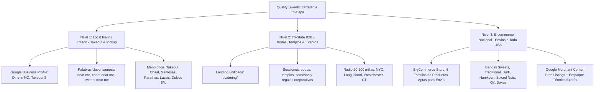

# Plan Estratégico de SEO Híbrido: Quality Sweets
**Dominio:** [qualitysweetsnj.com](https://qualitysweetsnj.com/)  
**Ubicación Física:** 1384 Oak Tree Road, Iselin, NJ 08830 (Edison / Iselin - Corredor "Little India")  
**Modelo de Servicio:** **Takeout & Pickup Only (Sin mesas / No Dine-In)** + **E-commerce Nacional (Envíos USA)** + **Catering Regional Tri-State (NJ, NY, CT)**  
**Plataforma Web:** BigCommerce  
**Propietario / Contacto:** Sanjeev Saini (CEO)  
**Diferencial Central:** **100% Vegetariano | Hecho Diario en EE. UU. | SIN CONSERVANTES (NO PRESERVATIVES) | Samosas Nunca Congeladas**

---

## 1. Resumen Ejecutivo y Diagnóstico Real del Negocio

Quality Sweets opera un modelo comercial híbrido de alta rentabilidad pero con características operativas que deben comunicarse con absoluta precisión en SEO:

1. **Tienda Física en Oak Tree Road (Iselin, NJ):** 
   * Abierta desde 2003 (en la ubicación actual desde 2010).
   * **Modelo 100% Takeout & Counter Pickup:** **No cuenta con mesas ni servicio de comedor (No Dine-In)**. Es un mostrador de alta rotación donde los clientes compran comida caliente para llevar (Chaat, Samosas, Chole Bhature, Parathas) y dulces frescos por libra ($/lb) de las vitrinas.
   * *Implicación SEO crítica:* Declarar expresamente `Dine-in: No` en Google Business Profile y Schema.org para blindar la reputación frente a comensales que buscan restaurantes para sentarse.
2. **E-commerce Nacional en BigCommerce:** 
   * Venta de dulces tradicionales, snacks secos, nueces con especias y cajas de regalo festivas enviadas con protección térmica a cualquier estado de EE. UU.
3. **Canal Institucional y B2B en el Tri-State (NJ, NY, CT):** 
   * Abastecimiento mayorista de dulces (*Prasad*) para templos y mandirs, mesas de postres para bodas indias y cajas de regalo corporativas para Diwali.

### Comparativa de Autoridad Digital Inicial:
| Negocio / Dominio | Tráfico Orgánico Mensual | Palabras Clave Indexadas | Domain Authority (DA) | Backlinks Totales | Enfoque Principal |
|---|---|---|---|---|---|
| **Quality Sweets** (`qualitysweetsnj.com`) | ~1,385 - 2,869 / mes | ~205 - 950 | **14** | 212 (177 dominios) | Takeout Iselin + E-commerce nacional |
| **Sukhadia's** (`sukhadia.com`) | **44,120 / mes** | 2,020 | **29** | 16,805 (788 dominios) | E-commerce nacional masivo + Catering + Tienda |
| **Bikanervala USA** (`bikanervalausa.com`) | **21,186 / mes** | 417 | **22** | 743 (311 dominios) | Marca multinacional franquiciada |
| **Mithaas** (`mithaasusa.com`) | ~531 / mes | 152 | **14** | 125 (39 dominios) | Locales físicos en NJ, casi sin e-commerce |

---

## 2. La Propuesta de Valor Única (El "Moat" Defensivo de Quality Sweets)

Frente a la producción industrial y congelada de los grandes competidores, Quality Sweets posee 4 pilares inimitables:
1. **Sello Oficial "NO PRESERVATIVES":** A diferencia de las marcas empaquetadas que usan conservantes químicos para durar meses, Quality Sweets elabora todo fresco a diario con ingredientes puros y leche fresca.
2. **Samosas Hechas al Día (Never Frozen):** El relleno de papas y especias y la masa se elaboran frescos cada mañana.
3. **Maestría en Dulces Bengalíes (21 Variedades Reales):** La mayor selección artesanal de dulces de *chhena* fresco en el Tri-State (Chum Chum en 5 sabores, Rasgulla, Sandesh, Kalakand, Kadam Keer, etc.).
4. **Precios Mayoristas Insuperables:** Capacidad demostrada para abastecer templos y bodas a precios directos de obrador sin intermediarios.

---

## 3. Estrategia por Capas Geográficas (El Enfoque de 3 Niveles)

---

### Nivel 1: SEO Local & Google Maps (Takeout & Counter Pickup Only)
*Objetivo: Dominar el Local 3-Pack en Iselin, Edison, Woodbridge y el centro de NJ para pedidos de mostrador y comida para llevar.*

1. **Configuración Estricta de Atributos en Google Business Profile (GBP):**
   * **Categoría Primaria:** `Indian sweets shop` (o `Candy store`).
   * **Categorías Secundarias:** `Indian takeaway`, `Vegetarian restaurant`, `Caterer`.
   * **Atributos de Servicio (VITALES):**
     * **Dine-in (Comer en el local): NO** *(Evita clientes molestos y reseñas de 1 estrella por falta de mesas)*.
     * **Takeout (Para llevar): SÍ**
     * **Delivery (A domicilio / Envíos): SÍ**
     * **Curbside Pickup (Recogida): SÍ**
   * **Nombre comercial oficial:** `Quality Sweets - Taste The Tradition`.
   * **Dirección oficial única:** `1384 Oak Tree Road, Iselin, NJ 08830` (eliminando la antigua de `1396 Oak Tree Rd`).
   * **Horarios:** 7 días a la semana de 10:00 AM a 8:00 PM.
   * **Enlace web en GBP:** Apuntando a la página local `/visit-iselin-oak-tree-road/` (o Home) con Schema LocalBusiness.
   * **Contacto directo:** Incluir el teléfono de la tienda para pedidos y recogidas sin esperas.

2. **Captura de Palabras Clave Locales de Alta Intención (Del Estudio de 136 Keywords):**
   * `indian sweets near me` (18,100 vol | KD 19)
   * `samosa near me` (18,100 vol | KD 28)
   * `pani puri near me` (18,100 vol | KD 26)
   * `chaat near me` (14,800 vol | KD 41)
   * `chole bhatura near me` (5,400 vol | KD 22)
   * `bengali sweets near me` (720 vol | KD 27)
   * `indian sweet shop near me` (8,100 vol | KD 17)
   * `takeout indian food` (880 vol | KD 36)

---

### Nivel 2: Alcance Regional Tri-State (NJ, NY, CT — B2B & Eventos)
*Objetivo: Capturar a organizadores de bodas, familias de NYC/CT que viajan a comprar en volumen y administradores de templos.*

1. **La Realidad de Búsqueda Regional:**
   Nadie en Stamford, CT o Queens, NY buscará "pani puri near me" para ir a Iselin. Pero sí buscarán:
   * Cajas de recuerdo para bodas indias (`indian sweet gift box`, `wedding return gifts mithai`).
   * Proveedores de dulces al por mayor para templos hindúes (`temple prasad bulk orders`, `bulk mithai order`).
   * Grandes pedidos de samosas calientes para fiestas familiares (`bulk samosa order`, `samosa catering`).
2. **Página de Servicio Regional B2B a Implementar:**
   * `/catering/`: Una sola landing de catering que integra secciones de bodas y *return gifts*, Prasad para templos y Mandirs, samosas y snacks por volumen, y regalos corporativos. Los encabezados, FAQs y enlaces ancla conservan la relevancia de cada intención sin fragmentar la autoridad de la página.

---

### Nivel 3: E-commerce Nacional (BigCommerce — Envíos a Todo USA)
*Objetivo: Vender dulces artesanales frescos y cajas festivas a la diáspora india en cualquier estado del país.*

1. **Estructuración del Catálogo Online (5 Colecciones con Palabras Clave Exactas):**
   A diferencia del menú físico (que incluye Chaat preparado con yogur), la tienda online ofrece productos que resisten el viaje de 1 a 2 días con empaque térmico:
   * **Colección 1: Bengali Sweets (`/collections/bengali-sweets/`):** Keyword exacta: *"bengali sweets"* (**2,900 / mes**). Chum Chum (5 variedades), Rasgulla, Sandesh, Kalakand, Kadam Keer.
   * **Colección 2: Mithai Tradicional (`/collections/mithai/`):** Keyword exacta: *"mithai"* (**4,400 / mes** | KD 14). Motichur Ladoo, Besan Ladoo, Kesar Peda, Gulab Jamun, Gujia, Jalebi. *(Previene canibalización con "indian sweets" que lidera la Home)*.
   * **Colección 3: Barfi & Kaju Katli (`/collections/barfi/`):** Keyword exacta: *"barfi"* (**9,900 / mes**) / *"burfi"* (**2,400 / mes**). Incluye Kaju Katli puro (**12,100 / mes**), Milk Cake, Pista Burfi.
   * **Colección 4: Indian Snacks (`/collections/indian-snacks/`):** Keyword exacta: *"indian snacks"* (**9,900 / mes**). Mathi (**1,000 / mes**), Namak Para (**880 / mes**), Gud Para, Sev y frutos secos especiados.
   * **Colección 5: Mithai Boxes & Baskets (`/collections/mithai-box/`):** Keyword exacta: *"mithai box"* (**480 / mes**) / *"diwali sweets"* (**2,900 / mes**). Cajas Ganesh, Peacock Box, Baskets de 5 y 10 Lb, Karva Chauth Box.

2. **Google Merchant Center Free Listings:**
   * Conectar el inventario de BigCommerce para que los productos aparezcan gratis en la pestaña de Google Shopping a nivel nacional para términos como *"buy kaju katli online"*, *"fresh chum chum delivery usa"*.
   * Marcado JSON-LD `Product` con `OfferShippingDetails` y garantía de entrega fresca.

---

## 4. Estrategia de Conversión y Embudo de Ventas (Alex Hormozi Framework)

Para maximizar el valor de vida del cliente (LTV) y elevar el ticket promedio actual de **$35**:

1. **Para Clientes de Mostrador en Iselin (Takeout & Pickup):**
   * *"Order Ahead via WhatsApp, Pick Up in 10 Minutes — Skip the Line at Oak Tree Rd."*
   * "Samosa & Chai Combo" o "Chaat Box para Llevar" empaquetada para mantener la textura crujiente en el trayecto a casa.
2. **Para Novios y Wedding Planners del Tri-State:**
   * **The Wedding Tasting Box:** Una caja curada con 6 especialidades de mithai y muestras de cajas de recuerdo doradas (Ganesh / Peacock Boxes) enviada a su domicilio en NY, NJ o CT por $29. Si contratan el pedido de la boda, el monto se abona 100% a la factura final.
3. **Para Administradores de Templos y Mandirs:**
   * **Temple Prasad Agreement:** Precios mayoristas escalonados por volumen con entregas programadas fijas los fines de semana.
4. **Para Compradores de E-commerce Nacional:**
   * **Garantía Cero Riesgo:** *"Freshness & Breakage Guarantee: Handcrafted fresh daily in New Jersey with insulated temperature protection. If your sweets don’t arrive in perfect condition, we replace them immediately."*

---

## 5. Metas y KPIs a 3, 6 y 12 Meses

| Métrica Clave | Situación Actual (Línea Base) | Mes 3 (Post-Lanzamiento) | Mes 6 (Expansión) | Mes 12 (Liderazgo) |
|---|---|---|---|---|
| **Tráfico Orgánico Mensual** | ~1,385 visitas | 3,500 visitas | 8,000 visitas | 18,000+ visitas |
| **Palabras Clave en Top 3 (Google)** | 13 - 17 | 45 | 120 | 300+ |
| **Palabras Clave en Top 10 (Google)** | 58 - 72 | 150 | 350 | 800+ |
| **Reseñas en Google Business Profile** | Base actual | +50 reseñas verificadas | +120 reseñas | +250 reseñas (Rating > 4.7) |
| **Llamadas y WhatsApp desde Maps/Web**| Base actual | +40% pedidos takeout | +85% pedidos takeout | +150% interacciones |
| **Ventas E-commerce (Tráfico Orgánico)**| Base incipiente | +$5,000 / mes | +$15,000 / mes | +$35,000+ / mes |
| **Domain Authority (DA)** | 14 | 16 | 20 | 25+ |
